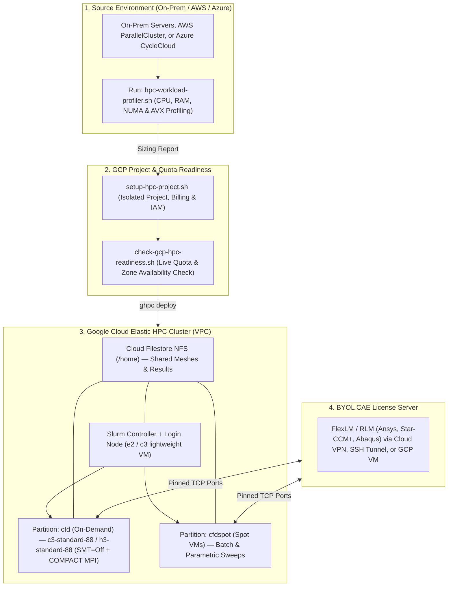

# Sim2GCP — Turnkey HPC & CAE Simulation Migration Kit for Google Cloud

[](https://opensource.org/licenses/Apache-2.0)
[](https://github.com/jassouline/gcp-hpc-migration-kit/actions/workflows/validate.yml)
[](https://github.com/GoogleCloudPlatform/cluster-toolkit)
[](https://slurm.schedmd.com/)

> **🇫🇷 Version française disponible ici :** [**README.fr.md**](./README.fr.md)  
> **🌐 Interactive Sizing Calculator & Blueprint Generator :** [**https://jassouline.github.io/gcp-hpc-migration-kit/**](https://jassouline.github.io/gcp-hpc-migration-kit/) *(or open [`docs/index.html`](./docs/index.html) locally)*.

**Sim2GCP (`gcp-hpc-migration-kit`)** is a self-service, zero-DevOps migration toolkit designed for **engineering teams, physicists, R&D scientists, and CAE engineers** running Computational Fluid Dynamics (CFD), Finite Element Analysis (FEA), thermal modeling, or multiphysics simulations (**Ansys Fluent / CFX / Mechanical, OpenFOAM, Siemens Star-CCM+, Dassault Abaqus, COMSOL, LS-DYNA**).

Whether you are migrating from **saturated on-premise workstations/clusters**, **AWS ParallelCluster**, or **Azure CycleCloud**, this repository provides all the scripts, quota checkers, pre-tuned Slurm blueprints, and BYOL licensing guides needed to deploy an elastic **Scale-to-Zero HPC cluster on Google Cloud in under 30 minutes**—using only **Google Cloud Shell** (no local software installation required).

---

## Why Engineering Teams Use This Kit

Most official cloud HPC documentation assumes you have a dedicated DevOps/Infrastructure team. In practice, simulation migrations get stuck on **four very specific roadblocks** that this kit solves out of the box:

1. **"What exact hardware do we currently saturate, and what is the Google Cloud equivalent?"**  
   → Solved by [`1-assess/hpc-workload-profiler.sh`](./1-assess/hpc-workload-profiler.sh), a zero-dependency Bash script that runs on your existing On-Prem server, AWS EC2 (`c6i`, `c7i`, `hpc6a`, `hpc7a`), or Azure VM (`HBv3`, `HBv4`), measures real per-core CPU and memory saturation during a solver run, and recommends the optimal GCP machine family (**C3**, **C3D**, **H3**, or **C4**).
2. **"How do we isolate our HPC project, link our Cloud Credits/Billing, and avoid quota failures during deployment?"**  
   → Solved by [`2-foundation/setup-hpc-project.sh`](./2-foundation/setup-hpc-project.sh) and [`2-foundation/check-gcp-hpc-readiness.sh`](./2-foundation/check-gcp-hpc-readiness.sh), which automatically verify your live regional vCPU quotas (`C3_CPUS`, `H3_CPUS`, `C3D_CPUS`), list the zones where your selected machine series is offered, and generate a ready-to-paste Quota Increase justification if your current project quota is below your target cluster size.
3. **"How do we configure Slurm with Hyper-Threading disabled, Compact Placement, gVNIC, and Scale-to-Zero ($0 idle cost)?"**  
   → Solved by turnkey YAML blueprints in [`3-blueprints/`](./3-blueprints/) pre-configured for **Cloud HPC Toolkit (`ghpc`)** with both On-Demand and **Spot VM** partitions.
4. **"How do we connect our on-premise FlexLM / RLM license server (Bring Your Own License) and launch multi-node MPI jobs?"**  
   → Solved by [`4-licensing-and-jobs/BYOL_LICENSING_GUIDE.md`](./4-licensing-and-jobs/BYOL_LICENSING_GUIDE.md) and ready-to-run [`sbatch` templates](./4-licensing-and-jobs/sbatch-templates/).

---

## End-to-End Architecture & Migration Workflow



---

## Repository Structure

```text
gcp-hpc-migration-kit/
├── README.md                                  # English Documentation & Quickstart
├── README.fr.md                               # Guide complet en Français
├── 1-assess/
│   └── hpc-workload-profiler.sh               # Non-root hardware & live saturation profiler (On-Prem/AWS/Azure)
├── 2-foundation/
│   ├── GUIDE_PROJECT_IAM_QUOTAS.md            # Self-service guide for Billing, IAM, Budgets & Quotas
│   ├── setup-hpc-project.sh                   # Automated GCP Project, Billing link, API & IAM bootstrapper
│   └── check-gcp-hpc-readiness.sh             # Live regional vCPU quota & zone availability checker
├── 3-blueprints/
│   ├── cfd-c3-slurm.yaml                      # Intel Xeon 4th Gen (C3) Slurm v6 blueprint (CFD/Multi-purpose)
│   ├── cfd-h3-slurm.yaml                      # High-Memory-Bandwidth (H3, 88 physical cores) Slurm v6 blueprint
│   └── fea-highmem-slurm.yaml                 # High-RAM (c3-highmem-176 + Local NVMe scratch) FEA blueprint
├── 4-licensing-and-jobs/
│   ├── BYOL_LICENSING_GUIDE.md                # FlexLM / RLM connectivity (Cloud VPN, SSH Tunnel, or GCP VM)
│   └── sbatch-templates/
│       ├── submit_ansys_fluent.sh             # Multi-node Ansys Fluent MPI submission script
│       ├── submit_openfoam.sh                 # Multi-node OpenFOAM (decomposePar / simpleFoam / pimpleFoam)
│       ├── submit_abaqus_fea.sh               # Multi-node Abaqus FEA with NVMe scratch staging
│       └── submit_python_parametric_sweep.py  # Python automation for batch parametric sweeps on Slurm
└── docs/
    └── index.html                             # Interactive GitHub Pages HPC Sizing & Blueprint Generator
```

---

## Quick Reference: Migrating from On-Prem, AWS, or Azure to Google Cloud

### 1. Compute Family Mapping for CAE / Simulation Workloads

| Workload Profile | Typical Solvers | On-Prem Equivalent | AWS Equivalent | Azure Equivalent | Recommended GCP Machine | Physical Cores (with `threads_per_core=1`) | RAM per Node | Network Bandwidth |
| :--- | :--- | :--- | :--- | :--- | :--- | :--- | :--- | :--- |
| **CFD & Balanced Multiphysics** | Ansys Fluent, CFX, Star-CCM+, SU2 | Dual Xeon Gold/Platinum (32–64c) | `c6i.24xlarge` / `c7i.24xlarge` | `Standard_F72s_v2` / `FX48mds` | **`c3-standard-88`** *(or `c3-standard-176`)* | **44 cores** *(or 88 cores)* | 352 GB *(or 704 GB)* | Up to 200 Gbps (Tier_1 / gVNIC) |
| **Memory-Bandwidth-Bound CFD / Weather** | OpenFOAM, WRF, Large-Eddy Simulation (LES) | AMD EPYC Milan-X / Xeon Max | `hpc6a.48xlarge` | `Standard_HB120rs_v3` (`HBv3`) | **`h3-standard-88`** | **88 physical cores** *(HT disabled by default)* | 352 GB (8-ch DDR5) | Up to 200 Gbps |
| **High-Core-Density Scaling** | Explicit Crash (LS-DYNA, Radioss), Molecular Dynamics | Dual AMD EPYC 9654 (90–128c) | `hpc7a.96xlarge` | `Standard_HB176rs_v4` (`HBv4`) | **`c3d-standard-180`** | **90 cores** | 720 GB | Up to 200 Gbps |
| **RAM-Intensive FEA & Electromagnetics** | Ansys Mechanical, Abaqus Standard, COMSOL, HFSS | High-RAM Workstations (512 GB–1.5 TB) | `r6i.32xlarge` / `hpc6id.32xlarge` | `Standard_E96s_v5` / `HX176rs` | **`c3-highmem-88`** *(or `c3-highmem-176`)* | **44 cores** *(or 88 cores)* | 704 GB *(or 1,408 GB)* | Up to 200 Gbps |

> [!IMPORTANT]
> **Always Disable Simultaneous Multithreading (Hyper-Threading) for MPI Solvers:**  
> On Google Cloud, standard vCPUs represent logical threads (2 vCPUs = 1 physical core, except on `H3` where 1 vCPU = 1 physical core). All blueprints in [`3-blueprints/`](./3-blueprints/) set `threads_per_core: 1` (or use `H3`), ensuring every MPI rank binds to a dedicated physical core with 100% of its L1/L2/AVX-512 pipeline. **Note that GCP quota (`C3_CPUS`, `C3D_CPUS`) is still metered against the nominal vCPU count of the instance** (e.g., a `c3-standard-88` with `threads_per_core: 1` exposes 44 physical cores to Linux/Slurm, and consumes 88 `C3_CPUS` of quota).
> - **Regional Availability Note:** Check the official [Google Cloud Compute Engine Regions and Zones documentation](https://cloud.google.com/compute/docs/regions-zones#available) or run [`2-foundation/check-gcp-hpc-readiness.sh`](./2-foundation/check-gcp-hpc-readiness.sh) to list the exact zones offering `C3`, `C3D`, `H3`, or `C4` instances in your target region.

### 2. Orchestrator & Storage Mapping (AWS ParallelCluster / Azure CycleCloud → GCP)

| Component | AWS ParallelCluster | Azure CycleCloud | Google Cloud Cluster Toolkit (`ghpc`) |
| :--- | :--- | :--- | :--- |
| **Cluster Definition** | `cluster-config.yaml` (`pcluster create-cluster`) | CycleCloud Template `.txt` / ARM | `blueprint.yaml` (`./ghpc create` + `./ghpc deploy`) |
| **Low-Latency NIC** | EFA (Elastic Fabric Adapter) | InfiniBand (Mellanox IB) | **gVNIC** + **Tier_1 Networking** (up to 200 Gbps) |
| **Node Proximity** | Placement Group (`cluster`) | Proximity Placement Group (PPG) | **Resource Policy (`COMPACT` max_distance=1)** |
| **Shared Storage** | Amazon EFS / FSx for Lustre | Azure NetApp Files / Managed Lustre | **Cloud Filestore (NFS)** or **Google Cloud Managed Lustre / Parallelstore** |
| **Scheduler** | Slurm (AWS plugin) | Slurm (CycleCloud plugin) | **Slurm v6** (Google Cloud Terraform modules) |

---

## Step-by-Step Quickstart (30 Minutes)

### Step 1 — Profile Your Current Server or Cloud Instance (5 min)

Copy [`1-assess/hpc-workload-profiler.sh`](./1-assess/hpc-workload-profiler.sh) onto your existing on-premise server, AWS EC2 node, or Azure VM and run it—ideally while a representative simulation is running:

```bash
chmod +x 1-assess/hpc-workload-profiler.sh
./1-assess/hpc-workload-profiler.sh -d 60 -i 2
```

The script requires **no `root` privileges** and **no external packages**. It generates a complete Markdown report (`hpc_profile_<hostname>_<timestamp>.md`) and time-series CSV with:
- Exact CPU model, physical core count, NUMA nodes, and AVX2 / AVX-512 flags.
- Per-core saturation (detecting whether your job is compute-bound, memory-bandwidth-bound, or license-limited).
- Peak RAM per active core and automatic recommendation of the target GCP instance (`c3-standard-88`, `c3-highmem-88`, `h3-standard-88`, or `c3d-standard-180`).

---

### Step 2 — Bootstrap an Isolated GCP Project & Check Regional Quotas (10 min)

Open **[Google Cloud Shell](https://shell.cloud.google.com)** (which comes with `gcloud`, `terraform`, `git`, and `go` pre-installed) and clone this repository:

```bash
git clone https://github.com/jassouline/gcp-hpc-migration-kit.git
cd gcp-hpc-migration-kit
```

1. **Create an isolated HPC project & attach your Billing Account** (optional if you already have a project):
   ```bash
   chmod +x 2-foundation/setup-hpc-project.sh
   ./2-foundation/setup-hpc-project.sh --project-id my-company-hpc-cfd
   ```
   *(See [`2-foundation/GUIDE_PROJECT_IAM_QUOTAS.md`](./2-foundation/GUIDE_PROJECT_IAM_QUOTAS.md) for instructions on finding your Billing Account ID, configuring Budget Alerts, and granting access to simulation engineers).*

2. **Verify your regional vCPU Quotas & Zone Availability BEFORE deploying**:
   > [!WARNING]
   > Google Cloud projects enforce regional, per-family vCPU quota limits (`C3_CPUS`, `H3_CPUS`, `C3D_CPUS`) that vary by project and billing configuration. Always run the readiness checker before deploying a multi-node cluster to confirm your current quota covers your target node count!

   ```bash
   chmod +x 2-foundation/check-gcp-hpc-readiness.sh
   ./2-foundation/check-gcp-hpc-readiness.sh --project my-company-hpc-cfd --cores 512 --family C3 --region europe-west1
   ```
   This script queries your live quota in the target region, lists which zones offer your chosen machine family, and—if your quota is lower than your target—prints the exact **Console link and justification text** to request an increase.

---

### Step 3 — Deploy Your Elastic Slurm Cluster with Cluster Toolkit (10 min)

Still in **Google Cloud Shell**, compile and deploy the Cluster Toolkit blueprint matching your workload (for example, [`3-blueprints/cfd-c3-slurm.yaml`](./3-blueprints/cfd-c3-slurm.yaml)):

```bash
# 1. Build the Cluster Toolkit binary (if not already installed in Cloud Shell)
if [ ! -f ./ghpc ]; then
  git clone --branch v1.73.0 --depth 1 https://github.com/GoogleCloudPlatform/cluster-toolkit.git /tmp/cluster-toolkit
  (cd /tmp/cluster-toolkit && make)
  cp /tmp/cluster-toolkit/ghpc ./ghpc
fi

# 2. Generate the deployment folder for your project and region/zone
./ghpc create 3-blueprints/cfd-c3-slurm.yaml \
  --vars project_id="$(gcloud config get-value project)" \
  --vars region="europe-west1" \
  --vars zone="europe-west1-c"

# 3. Provision the VPC, Filestore NFS (/home), and Slurm Controller
./ghpc deploy hpc-slurm-c3 --auto-approve
```

Once deployed:
- **0 compute nodes run when idle** ($0/hour compute cost between simulation campaigns).
- Connect to the Slurm login node with a single command:
  ```bash
  gcloud compute ssh hpc-slurm-c3-login-001 --zone="europe-west1-c" --tunnel-through-iap
  ```

---

### Step 4 — Connect Your License Server & Submit Jobs (5 min)

1. Follow [`4-licensing-and-jobs/BYOL_LICENSING_GUIDE.md`](./4-licensing-and-jobs/BYOL_LICENSING_GUIDE.md) to connect your **FlexLM / RLM license server** via:
   - **Option A (Fastest PoC — 2 min, zero firewall change):** Reverse SSH port forwarding from your on-prem workstation to the Slurm login node.
   - **Option B (Production):** Site-to-Site Cloud VPN with pinned vendor daemon TCP ports.
   - **Option C (Cloud-Hosted):** Hosting a split license pack on a lightweight GCP VM with a static internal IP.
2. Copy the ready-to-use Slurm job scripts from [`4-licensing-and-jobs/sbatch-templates/`](./4-licensing-and-jobs/sbatch-templates/) to `/home` on the login node and submit your run:
   ```bash
   sbatch submit_ansys_fluent.sh
   squeue -u $USER
   ```
   Slurm automatically powers on the required `c3-standard-88` or `h3-standard-88` nodes in a `COMPACT` placement group, executes the MPI job across 512+ physical cores, writes results to `/home`, and **powers the compute nodes back down automatically after 5 minutes of inactivity**.

---

## Destroying the Cluster When Done

To tear down all infrastructure (Filestore NFS, Slurm controller, VPC) when a PoC or campaign is finished:

```bash
./ghpc destroy hpc-slurm-c3 --auto-approve
```

---

## License

This project is licensed under the **Apache License 2.0**.
